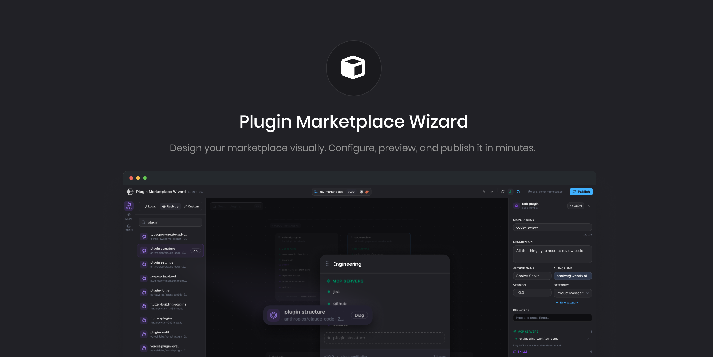

<picture>
  
</picture>

[](https://github.com/webrix-ai/plugin-marketplace-wizard/actions/workflows/ci.yml)
[](https://www.npmjs.com/package/plugin-marketplace-wizard)
[](LICENSE)

A CLI tool with a visual editor for creating, managing, and exporting agent plugin marketplace packages. Discover MCP servers and skills from your local environment, browse official registries, and assemble plugins using an interactive drag-and-drop canvas.

<h1 align="center">Plugin Marketplace Wizard</h1>

<p align="center">
  A visual editor for building agent plugin marketplaces — discover MCPs and skills, drag them onto a canvas, and export ready-to-ship packages.
</p>

<p align="center">
  <a href="https://www.npmjs.com/package/plugin-marketplace-wizard"></a>
  <a href="https://www.npmjs.com/package/plugin-marketplace-wizard"></a>
  <a href="#license"></a>
</p>

<p align="center">
  Generates valid marketplace packages for
  <a href="https://cursor.com/docs/plugins"> Cursor</a> and
  <a href="https://code.claude.com/docs/en/discover-plugins"> Claude Code</a>
</p>

---

## Quick Start

```bash
npx create-plugin-marketplace-wizard my-marketplace
cd my-marketplace
npm start
```

That's it. A browser window opens with the visual editor pointed at your new marketplace.

> **Adding to an existing project?**
>
> ```bash
> npm install plugin-marketplace-wizard --save-dev
> npx pmw init
> npm start
> ```

## What You Get

Plugin Marketplace Wizard gives you a drag-and-drop canvas for assembling plugin packages. It scans your local environment for MCP servers and skills, lets you search official registries, and writes valid marketplace manifests on every change.

**The output** is a directory you can publish or distribute:

```
my-marketplace/
├── .cursor-plugin/
│   └── marketplace.json
├── .claude-plugin/
│   └── marketplace.json
└── plugins/
    └── <plugin-slug>/
        ├── .cursor-plugin/plugin.json
        ├── .claude-plugin/plugin.json
        ├── .mcp.json
        └── skills/
            └── <skill-name>/
                └── SKILL.md
```

## Features

|                         |                                                                                                                                                   |
| ----------------------- | ------------------------------------------------------------------------------------------------------------------------------------------------- |
| **Visual Canvas**       | Drag-and-drop interface built on ReactFlow for assembling and organizing plugins                                                                  |
| **Local Discovery**     | Scans Cursor, Claude, VS Code, Windsurf, Zed, Cline, Roo, and other IDE configs for MCP servers and skills                                        |
| **Official Registries** | Search the [MCP Registry](https://registry.modelcontextprotocol.io) and [Skills.sh](https://skills.sh) for community-published servers and skills |
| **Custom Registries**   | Connect any registry that implements the MCP Server Registry API                                                                                  |
| **Real-time Auto-save** | Persists changes directly to your marketplace directory as you edit                                                                               |
| **Inline Validation**   | Visual indicators for configuration issues on the canvas                                                                                          |
| **CI Validation**       | Run `pmw test` in your pipeline to catch errors before deploy                                                                                     |
| **Category Grouping**   | Plugins with the same category are automatically grouped into labeled regions                                                                     |
| **Plugin Search**       | Press `Cmd+K` to find and focus any plugin on the canvas                                                                                          |
| **Skill File Import**   | Drop `.zip` or `.skill` files onto plugin cards or the canvas                                                                                     |
| **Hot Reload**          | Watches for external file changes and syncs automatically                                                                                         |
| **Undo / Redo**         | Full history with `Cmd+Z` / `Cmd+Shift+Z`                                                                                                         |

## CLI Reference

After installing, the `pmw` command is available in your npm scripts:

```json
{
  "scripts": {
    "start": "pmw start",
    "test": "pmw test"
  }
}
```

### `pmw start [dir]`

Start the visual editor. Opens a browser-based UI for managing your marketplace.

```bash
pmw start                # Current directory
pmw start ./my-market    # Specific directory
pmw start -p 4000        # Custom port
```

### `pmw test [dir]`

Validate all marketplace files. Designed for CI — exits non-zero on failure.

```bash
pmw test
```

```
 PMW v0.1.4

 /Users/you/my-marketplace

 PASS marketplace structure
 PASS marketplace manifest
 PASS plugin structure
 PASS plugin manifests
 PASS mcp configurations
 PASS skill files

 Tests:  6 passed, 6 total
 Time:   0.02s
```

### `pmw init [dir]`

Scaffold a new marketplace. Creates `.cursor-plugin/`, `.claude-plugin/`, and `plugins/` directories with initial manifests.

```bash
pmw init
pmw init ./new-marketplace
```

### `pmw -v` / `pmw -h`

Print version or show help.

## Deployment Guides

Once your marketplace is ready, follow the guide for your target platform:

- [Adding your marketplace to Cursor](docs/add-marketplace-to-cursor.md)
- [Adding your marketplace to Claude Code (CLI)](docs/add-marketplace-to-claude-code.md)
- [Adding your marketplace to Claude (Organization)](docs/add-marketplace-to-claude.md)

## TypeScript API

All types and validation utilities are exported from the package:

```typescript
import type {
  PluginData,
  McpServer,
  Skill,
  AgentData,
  MarketplaceManifest,
  MarketplaceSettings,
  ValidationIssue,
} from "plugin-marketplace-wizard"

import {
  validatePluginData,
  validateMarketplaceManifest,
  validateMcpServer,
  validateSkill,
} from "plugin-marketplace-wizard"
```

## Tech Stack

| Layer         | Technology                                       |
| ------------- | ------------------------------------------------ |
| Framework     | [Next.js 16](https://nextjs.org/) with Turbopack |
| UI            | [React 19](https://react.dev/)                   |
| Canvas        | [@xyflow/react](https://reactflow.dev/)          |
| State         | [Zustand](https://zustand.docs.pmnd.rs/)         |
| Styling       | [Tailwind CSS 4](https://tailwindcss.com/)       |
| Components    | [shadcn/ui](https://ui.shadcn.com/)              |
| Icons         | [Lucide React](https://lucide.dev/)              |
| Notifications | [Sonner](https://sonner.emilkowal.ski/)          |

## Contributing

Contributions are welcome. Here's how to get started:

```bash
git clone https://github.com/webrix-ai/plugin-marketplace-wizard.git
cd plugin-marketplace-wizard
npm install
npm run dev
```

This starts the Next.js dev server directly. To test via the CLI path instead:

```bash
node bin/cli.mjs start
```

Please read our [Contributing Guide](CONTRIBUTING.md) to get started.

For security issues, see [SECURITY.md](SECURITY.md).

**Before submitting a PR:**

1. Run `npm run lint` to check for lint errors
2. Run `npm test` to validate the sample marketplace
3. Keep commits focused — one logical change per PR

## License

[MIT](https://opensource.org/licenses/MIT)
