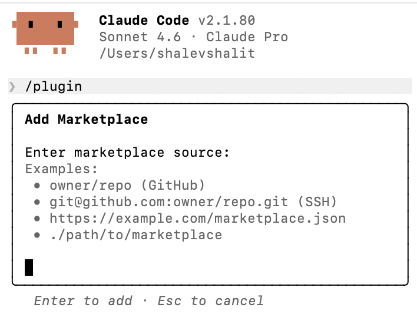

# Adding Your Marketplace to Claude Code

This guide walks you through adding your plugin marketplace to [Claude Code](https://code.claude.com/docs/en/discover-plugins) (the CLI).

## Prerequisites

- Claude Code version **1.0.33** or later (`claude --version`)
- Your marketplace repository pushed to GitHub (or any git host)

## Your marketplace structure

After running `pmw start` and saving, your marketplace directory should look like this:

```
my-marketplace/
├── .claude-plugin/
│   └── marketplace.json
├── plugins/
│   └── my-plugin/
│       ├── .claude-plugin/
│       │   └── plugin.json
│       ├── .mcp.json
│       └── skills/
│           └── my-skill/
│               └── SKILL.md
```

Push this to a GitHub repository (e.g. `your-org/my-marketplace`).

## Step 1: Add the marketplace

Open Claude Code in your terminal and run `/plugin`, then go to the **Marketplaces** tab and select **Add Marketplace**:



Enter your marketplace source using any of the supported formats:

```shell
/plugin marketplace add your-org/my-marketplace
```

This downloads the marketplace catalog from your GitHub repository and registers it locally. No plugins are installed yet.

### Other source types

You can also add from other sources:

```shell
# From any git host
/plugin marketplace add https://gitlab.com/your-org/my-marketplace.git

# From a local directory (great for testing)
/plugin marketplace add ./my-marketplace

# From a remote URL
/plugin marketplace add https://example.com/marketplace.json
```

## Step 2: Browse available plugins

Run the plugin manager:

```shell
/plugin
```

Navigate to the **Discover** tab to see all plugins from your marketplace. Use **Tab** to cycle between tabs (Discover, Installed, Marketplaces, Errors).

## Step 3: Install a plugin

Select a plugin from the Discover tab, then choose an installation scope:

- **User scope** — For yourself, across all projects (default)
- **Project scope** — For all collaborators on this repository
- **Local scope** — For yourself, in this repository only

Or install directly from the command line:

```shell
/plugin install my-plugin@my-marketplace
```

## Step 4: Activate the plugin

After installing, reload plugins to activate:

```shell
/reload-plugins
```

The plugin's skills, MCP servers, and other components are now available.

## Updating the marketplace

Refresh your marketplace to pull the latest plugins:

```shell
/plugin marketplace update my-marketplace
```

You can also enable auto-updates so the marketplace refreshes on every Claude Code startup:

1. Run `/plugin`
2. Go to the **Marketplaces** tab
3. Select your marketplace
4. Choose **Enable auto-update**

## Configure for your team

To automatically prompt team members to install your marketplace when they work on a project, add this to `.claude/settings.json` in your repository:

```json
{
  "extraKnownMarketplaces": {
    "my-marketplace": {
      "source": {
        "source": "github",
        "repo": "your-org/my-marketplace"
      }
    }
  }
}
```

To also enable specific plugins by default:

```json
{
  "enabledPlugins": {
    "my-plugin@my-marketplace": true
  }
}
```

## Managing plugins

```shell
# Disable a plugin without uninstalling
/plugin disable my-plugin@my-marketplace

# Re-enable a disabled plugin
/plugin enable my-plugin@my-marketplace

# Completely remove a plugin
/plugin uninstall my-plugin@my-marketplace

# Remove a marketplace (uninstalls all its plugins)
/plugin marketplace remove my-marketplace
```

## Testing locally

Before pushing to GitHub, test your marketplace locally:

```shell
/plugin marketplace add ./my-marketplace
/plugin install my-plugin@my-marketplace
```

## Further reading

- [Discover and install plugins](https://code.claude.com/docs/en/discover-plugins)
- [Create and distribute a plugin marketplace](https://code.claude.com/docs/en/plugin-marketplaces)
- [Plugins reference](https://code.claude.com/docs/en/plugins-reference)
