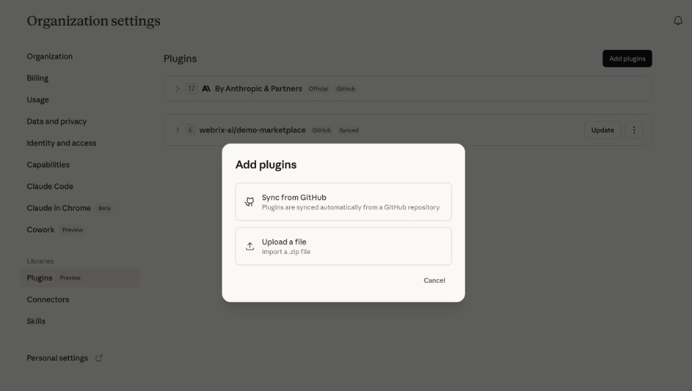

# Adding Your Marketplace to Claude (Organization Settings)

This guide walks you through adding your plugin marketplace to [Claude](https://claude.ai) via the organization settings on claude.ai or the Anthropic Console.

## Prerequisites

- An Anthropic organization account with admin access
- Your marketplace repository pushed to GitHub, **or** your marketplace exported as a `.zip` file

## Your marketplace structure

After running `pmw start` and saving, your marketplace directory should look like this:

```
my-marketplace/
├── .claude-plugin/
│   └── marketplace.json
├── plugins/
│   └── my-plugin/
│       ├── .claude-plugin/
│       │   └── plugin.json
│       ├── .mcp.json
│       └── skills/
│           └── my-skill/
│               └── SKILL.md
```

## Step 1: Open Organization Settings

1. Go to [claude.ai](https://claude.ai) and sign in with your admin account.
2. Navigate to **Organization settings** in the left sidebar.
3. Under **Libraries**, click **Plugins**.

## Step 2: Add plugins

Click the **Add plugins** button in the top right corner. You'll see two options:



### Option A: Sync from GitHub

Use this option if your marketplace is hosted on GitHub.

1. Select **Sync from GitHub**.
2. Paste your GitHub repository URL (e.g. `https://github.com/your-org/my-marketplace`).
3. Click **Continue**.
4. Claude will parse your `.claude-plugin/marketplace.json` and display the list of plugins.
5. Review the plugins and configure access settings.
6. Click **Save**.

Your marketplace will appear in the Plugins list with a **GitHub** and **Synced** badge. You can click **Update** at any time to pull the latest version from your repository.

### Option B: Upload a file

Use this option to import your marketplace as a `.zip` file.

1. Select **Upload a file**.
2. Zip your marketplace directory:

```bash
cd my-marketplace
zip -r ../my-marketplace.zip .
```

3. Upload the `.zip` file.
4. Claude will extract and parse the marketplace contents.
5. Review the plugins and configure access settings.
6. Click **Save**.

## Step 3: Manage your marketplace

Once added, your marketplace appears in the **Plugins** list. From here you can:

- **Update** — Pull the latest version from GitHub (for synced marketplaces).
- **View plugins** — Expand the marketplace to see all included plugins.
- **Configure access** — Control which team members can see and install the plugins.
- **Remove** — Delete the marketplace and its plugins.

## Submitting to the official marketplace

If you want your plugins to be available to all Claude users (not just your organization), you can submit them to the official Anthropic marketplace:

- **Claude.ai**: [claude.ai/settings/plugins/submit](https://claude.ai/settings/plugins/submit)
- **Console**: [platform.claude.com/plugins/submit](https://platform.claude.com/plugins/submit)

Submitted plugins are reviewed by Anthropic before being listed.

## Further reading

- [Discover and install plugins](https://code.claude.com/docs/en/discover-plugins)
- [Create and distribute a plugin marketplace](https://code.claude.com/docs/en/plugin-marketplaces)
