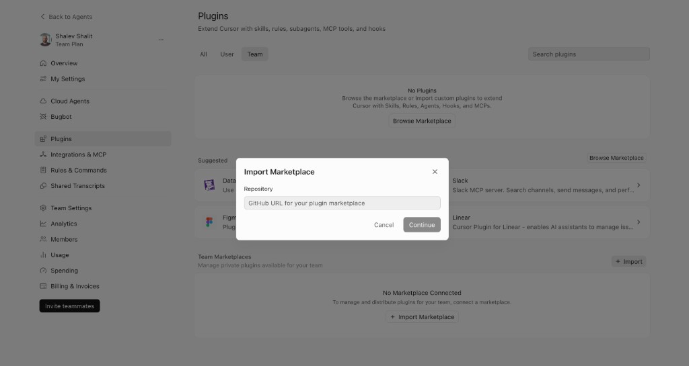

# Adding Your Marketplace to Cursor

This guide walks you through adding your plugin marketplace to [Cursor](https://cursor.com/docs/plugins).

## Prerequisites

- A Cursor **Teams** or **Enterprise** plan
- Admin access to your Cursor organization dashboard
- Your marketplace repository pushed to GitHub

## Your marketplace structure

After running `pmw start` and saving, your marketplace directory should look like this:

```
my-marketplace/
├── .cursor-plugin/
│   └── marketplace.json
├── plugins/
│   └── my-plugin/
│       ├── .cursor-plugin/
│       │   └── plugin.json
│       ├── .mcp.json
│       └── skills/
│           └── my-skill/
│               └── SKILL.md
```

Push this to a GitHub repository (e.g. `your-org/my-marketplace`).

## Step 1: Open the Plugins settings

Go to your Cursor organization **Dashboard** → **Settings** → **Plugins**.

You'll see a **Team Marketplaces** section below the Plugins list.

## Step 2: Import your marketplace

1. In the **Team Marketplaces** section, click **+ Import Marketplace**.
2. Paste your GitHub repository URL (e.g. `https://github.com/your-org/my-marketplace`) into the **Repository** field.
3. Click **Continue**.



4. Cursor will parse your `.cursor-plugin/marketplace.json` and show the list of plugins found.
5. Optionally set **Team Access** distribution groups to control who can see the plugins.
6. Set a marketplace **name** and **description**, then click **Save**.

## Step 3: Configure plugin distribution

For each plugin in your marketplace, you can set it as:

- **Required** — Automatically installed for everyone in the assigned distribution group.
- **Optional** — Available in the marketplace panel, each developer chooses whether to install it.

## Step 4: Developers install plugins

Your team members will find the marketplace plugins in the **Marketplace panel** inside Cursor:

1. Open the marketplace panel in Cursor.
2. Look for plugins from your team marketplace.
3. Install optional plugins directly from the panel.
4. Required plugins are installed automatically.

## Updating the marketplace

When you push changes to your GitHub repository, click **Update** next to your marketplace in the Plugins settings to pull the latest version. Cursor will sync the updated plugin list.

## Testing locally before publishing

Before pushing to GitHub, you can test individual plugins locally by copying them to `~/.cursor/plugins/local/`:

```bash
ln -s /path/to/my-marketplace/plugins/my-plugin ~/.cursor/plugins/local/my-plugin
```

Then restart Cursor or run **Developer: Reload Window** to load the plugin.

## Further reading

- [Cursor Plugins documentation](https://cursor.com/docs/plugins)
- [Cursor Marketplace](https://cursor.com/marketplace)
- [Plugin template repository](https://github.com/cursor/plugin-template)
